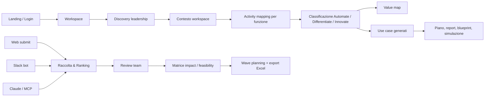
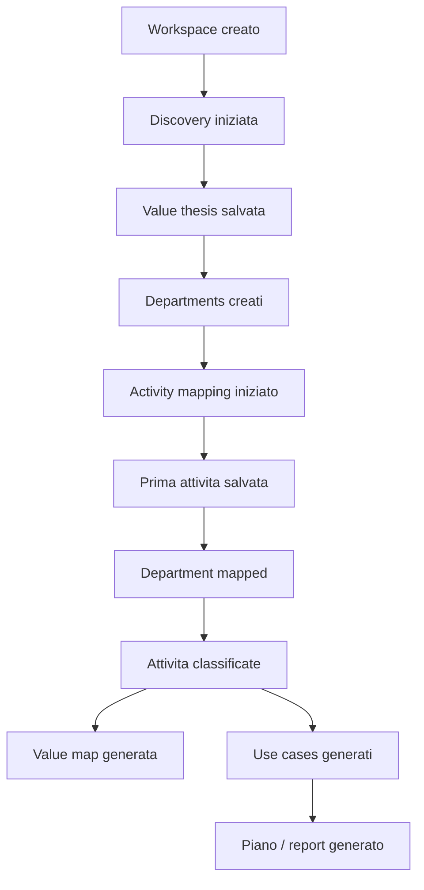
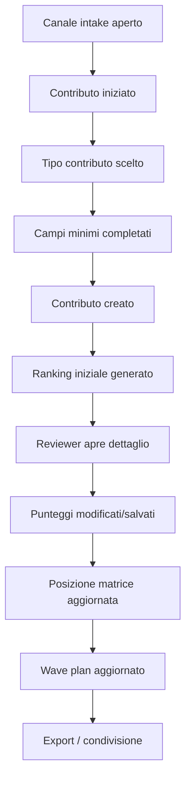

# Unbundle - UI/UX Diagnostic Note

Data analisi: 2026-07-05

Repository analizzato: `/Users/pierpaololaurito/unbundle`
Destinatari: founding team, product/design/engineering

## 1. Executive summary

Unbundle e un sistema operativo per AI transformation. Non e una semplice dashboard e non e un chatbot generico: e una piattaforma multi-tenant che trasforma conversazioni, documenti, attivita organizzative e contributi bottom-up in oggetti decisionali strutturati.

Il prodotto serve a tre lavori principali:

- Capire dove l'AI puo spostare valore nell'organizzazione.
- Mappare il lavoro reale delle funzioni e classificarlo in `Automate`, `Differentiate`, `Innovate`.
- Raccogliere, valutare e prioritizzare use case AI e best practice attraverso web app, Slack e integrazioni come Claude/MCP.

La promessa UX piu forte e questa: l'utente non deve compilare un business case da zero. Deve parlare, caricare documenti o segnalare un'idea; Unbundle deve trasformare quell'input in una mappa, una matrice, un ranking, un piano e output riutilizzabili.

La criticita principale e che il prodotto oggi contiene molti moduli potenti ma cognitivamente densi. La UI deve quindi aiutare l'utente a capire sempre:

- Dove sono nel percorso?
- Che cosa ho gia creato?
- Qual e il prossimo passo consigliato?
- Quale decisione posso prendere adesso?
- Quale parte e AI-generated e quale e stata validata da un umano?

## 2. Che cosa e Unbundle

Unbundle e una piattaforma per progettare e governare trasformazioni AI in azienda. Il workspace e il contenitore centrale: dentro un workspace vivono discovery, documenti, unita organizzative, attivita, obiettivi, use case, contributi raccolti da dipendenti, scoring, waves, report e integrazioni.

Il prodotto ha due anime complementari:

- Top-down transformation journey: leadership discovery, context, strategy, activity mapping, value map, generated use cases, plan, report, blueprint, simulation.
- Bottom-up portfolio intake: raccolta di use case AI e best practice da web, Slack e Claude, ranking su KPI custom, matrice, review, wave planning ed export.

Questa distinzione e fondamentale anche per la diagnostica: alcune metriche misurano la maturazione di una trasformazione guidata dal team centrale, altre misurano la capacita dell'organizzazione di far emergere contributi dal basso.

## 3. Modello mentale del prodotto

Il valore del prodotto nasce quando input non strutturati diventano asset strutturati:

- Conversazioni diventano value thesis, system boundary, departments, activities, goals.
- Documenti diventano contesto RAG e suggerimenti.
- Attivita diventano classificazioni e use case.
- Segnalazioni Slack/Web/Claude diventano contributi portfolio.
- Punteggi e KPI diventano ranking, matrici e waves.

## 4. Personas e ruoli

### Executive Sponsor

E il decisore o sponsor della trasformazione. Ha bisogno di capire rapidamente dove l'AI crea valore, quali sono le priorita e quali investimenti hanno senso. Nella UI deve vedere overview, report, piano, simulazione e stato generale.

### Transformation Lead / AI Builders

E il team che governa la trasformazione. Configura ranking, ESG, integrazioni, collaboratori, scoring model e review dei contributi. E la persona piu esposta alla complessita del prodotto.

### Function Lead

Partecipa al mapping di una funzione o valida attivita e use case. Ha bisogno di un'esperienza guidata, non di una dashboard troppo tecnica.

### Contributor / Employee

Segnala una best practice o un use case AI via web, Slack o Claude. Non deve conoscere la metodologia. Deve solo raccontare il processo, il problema, il beneficio e gli elementi minimi richiesti.

### Analyst / Reviewer

Valuta contributi, modifica punteggi, valida ranking e usa la matrice. Ha bisogno di trasparenza sul perche un use case e posizionato in un punto.

### External viewer

Puo ricevere un link condiviso da Slack. Se non ha accesso al workspace vede il portfolio in sola lettura; se ha account e permessi puo entrare nella dashboard editabile.

## 5. Oggetti dati principali

Gli oggetti principali emersi dalla codebase sono:

- `organizations`: azienda/organizzazione.
- `workspaces`: contenitore della trasformazione, con ESG, nome team AI, webhook e boundary.
- `workspaceMemberships`: accesso diretto al workspace con ruoli.
- `workspaceInvitations`: inviti link-based.
- `workspaceIntegrationTokens`: token per integrazioni esterne come Claude/MCP.
- `departments`: funzioni/unita da mappare.
- `activities`: attivita operative con input, output, decisioni, strumenti, tempi, pain point, classificazione e AI exposure.
- `strategicGoals`: goal, objectives e key results.
- `useCases`: sia use case generati dal mapping sia contributi portfolio bottom-up.
- `workspaceScoringModels`: KPI, pesi e soglie del ranking configurabile.
- `conversations` e `messages`: chat Discovery e Activity Mapping.
- `uploadedDocuments`: documenti caricati e usati come contesto.
- `slackUseCaseDrafts`: stato persistente delle conversazioni Slack.
- `reports`, `agentBlueprints`, `simulations`, `weeklySignals`: output avanzati.

## 6. User journey end-to-end

### 6.1 Landing e primo accesso

La landing e minimale, scura, istituzionale. Racconta Unbundle come framework per discovery, mapping e trasformazione AI. Il tono e high-end e poco SaaS standard. La pagina usa SEO/GEO e structured data.

Journey:

- L'utente arriva su `/`.
- Se e gia autenticato viene portato alla dashboard.
- Se non e autenticato vede la landing e puo accedere.
- Dopo login arriva alla lista workspace.

UX positiva:

- Visual language coerente con un prodotto premium.
- Messaggio centrale forte: "Iniziamo dalla Discovery".
- Framework in quattro passaggi facile da comunicare.

Rischi UX:

- La landing vende il percorso, ma l'app interna espone molti moduli subito. Serve continuita tra promessa e onboarding interno.
- Alcuni termini sono misti italiano/inglese (`Discovery`, `Framework`, `Use cases`, `AI OS`). Va scelto se questa ibridazione e intenzionale o se semplificare.

### 6.2 Dashboard workspace list

La pagina `/dashboard` mostra i workspace dell'utente, raggruppati tra organizzazione e workspace condivisi. Da qui si crea o si apre un workspace.

UX positiva:

- Il concetto di workspace e chiaro.
- Il badge "shared" aiuta a distinguere accessi diretti da accessi organizzativi.

Rischi UX:

- La differenza tra organizzazione, workspace e workspace condiviso potrebbe non essere ovvia per utenti non admin.
- Se il prodotto monetizzera le seats, questa pagina dovra esplicitare meglio chi ha accesso e con quale ruolo.

### 6.3 Workspace overview

L'overview e il primo hub del workspace. Mostra:

- Prossimo passo consigliato.
- Stato di Discovery, Strategia, Activity Mapping e Use Cases.
- Metriche come unita mappate, attivita classificate, use case generati.
- Tool grid per moduli avanzati.

UX positiva:

- Esiste un percorso guidato e non solo una sidebar.
- Il "prossimo passo" riduce il rischio di blocco iniziale.
- Le card di stato danno un senso di avanzamento.

Rischi UX:

- La sidebar mette molti moduli sullo stesso livello: Overview, Raccolta & Ranking, Discovery, Strategia, Activity mapping, Value map, Use cases, Piano, Report, Blueprints, Simulazione, Intelligence, Integrazioni.
- Questo crea una tensione: l'overview guida, la sidebar sembra una toolbox completa. Un nuovo utente puo non sapere cosa ignorare.

Diagnostica consigliata:

- Misurare quanti utenti seguono il next step vs quanti saltano casualmente tra moduli.
- Misurare il numero di ritorni all'overview prima di completare Discovery.
- Misurare quanto tempo passa prima del primo asset strutturato salvato.

### 6.4 Discovery leadership

La Discovery e una chat guidata che raccoglie contesto strategico. L'AI salva dati strutturati tramite tool server-side: value thesis, system boundary, terminologia delle unita, departments, goals.

La UI include:

- Chat centrale.
- Suggestions iniziali.
- Upload documenti.
- Sidebar destra con value thesis, departments e strategic goals.
- Tool pills che mostrano quando l'AI salva qualcosa.
- Stati di loading e idle nudge.

UX positiva:

- La chat abbassa la barriera di ingresso.
- La sidebar rende visibile che la conversazione produce dati.
- L'upload documenti permette di non partire da zero.
- Il messaggio iniziale e chiaro e orientato al valore.

Rischi UX:

- L'utente potrebbe non capire quali informazioni sono state salvate in modo definitivo.
- Il tool pill e utile per utenti avanzati, ma puo essere poco comprensibile per un executive.
- La chat puo sembrare "magica"; serve sempre un ponte tra conversazione e oggetto salvato.

Diagnostica consigliata:

- Tasso di Discovery started -> first value thesis saved.
- Tasso di value thesis saved -> at least one department created.
- Numero medio di turni prima di creare un department.
- Frequenza di messaggi utente che chiedono "cosa devo fare?" o simili.

### 6.5 Contesto

La pagina Contesto e una vista riepilogativa di cio che e stato raccolto in Discovery: value thesis, system boundary, departments, goals.

UX positiva:

- Funziona come "source of truth" leggibile.
- Aiuta a separare conversazione e asset finale.

Rischi UX:

- Se e vuota, deve spiegare in modo molto concreto cosa manca e come ottenerlo.
- Potrebbe diventare una pagina passiva se non offre azioni successive.

### 6.6 Strategia

La sezione Strategia gestisce goal, objectives e key results. L'utente puo crearli manualmente o chiedere suggerimenti AI.

UX positiva:

- Buona gerarchia Goal -> Objective -> KR.
- Il form consente KPI, target, baseline, owner e timeframe.
- Il suggerimento AI mantiene l'utente in controllo: non salva automaticamente.

Rischi UX:

- Per alcuni utenti puo sembrare una duplicazione della Discovery, che gia raccoglie obiettivi.
- Il passaggio da suggerimento AI a creazione manuale potrebbe essere percepito come friction.

Diagnostica consigliata:

- Quanti suggerimenti AI vengono generati.
- Quanti suggerimenti diventano goal reali.
- Tempo tra generazione suggerimento e salvataggio manuale.

### 6.7 Activity mapping

Il mapping avviene per singola unita/funzione. Se non ci sono departments, la pagina rimanda alla Discovery. Per ogni funzione l'utente puo avviare una chat di mapping o vedere la dashboard della funzione gia mappata.

La chat raccoglie:

- Input.
- Processo.
- Output.
- Decision points.
- Eccezioni.
- Strumenti.
- Frequenza e tempo.
- Pain points.
- Dati necessari.

Alla fine il sistema classifica le attivita nei tre stream:

- `Automate`: lavoro da eliminare, semplificare o automatizzare.
- `Differentiate`: lavoro dove concentrare energia umana.
- `Innovate`: nuove possibilita di valore.

UX positiva:

- Il mapping per funzione e un buon pattern: riduce il perimetro e rende la conversazione concreta.
- La sidebar mostra attivita salvate e dati emergenti.
- Il passaggio a dashboard post-mapping rende visibile l'output.

Rischi UX:

- Se l'intervista e lunga, l'utente deve percepire avanzamento.
- Le classificazioni AI devono essere spiegate, non solo mostrate.
- Il termine "mapped" puo essere chiaro internamente ma meno per l'utente finale.

Diagnostica consigliata:

- Mapping started -> first activity saved.
- First activity saved -> department mapped.
- Numero medio di attivita per funzione.
- Percentuale attivita senza tempo/frequenza/dati.
- Tasso di riapertura conversazione dopo dashboard.

### 6.8 Value map

La Value Map usa una rappresentazione tipo Wardley map. Posiziona attivita su due assi:

- Evoluzione/maturita.
- Valore strategico.

Le bolle hanno dimensione basata su ore settimanali e colore basato sullo stream.

UX positiva:

- E una visualizzazione distintiva e piu strategica della classica tabella.
- Aiuta a raccontare dove l'organizzazione sta spendendo tempo e dove si concentra valore.

Rischi UX:

- Il posizionamento potrebbe sembrare black-box.
- Non sembra esserci editing diretto dei nodi nella mappa.
- Gli utenti potrebbero non conoscere Wardley map.

Diagnostica consigliata:

- Quanti utenti generano la value map dopo classificazione.
- Quanti usano toggle label.
- Quanti tornano a mapping dopo aver visto la mappa.
- Survey breve: "La mappa ti aiuta a decidere cosa fare dopo?"

### 6.9 Use cases generati

La sezione Use Cases genera use case AI dalle attivita classificate. Mostra lista e matrice. Ogni use case ha score, categoria, timeline, status e possibile link con ESG.

UX positiva:

- Collega il lavoro mappato a opportunita attivabili.
- Lista e matrice servono due modalita cognitive diverse: audit e decisione.

Rischi UX:

- C'e sovrapposizione terminologica con Raccolta & Ranking, dove esistono anche "Use Case AI" bottom-up.
- Un utente potrebbe chiedersi: "Devo andare in Use cases o in Raccolta & Ranking?"

Raccomandazione:

- Distinguere chiaramente "Use case generati dal mapping" da "Contributi raccolti dall'organizzazione".
- Valutare naming come "Use case da mapping" e "Portfolio contributi".

### 6.10 Raccolta & Ranking

E il modulo piu importante per la governance bottom-up. Permette di raccogliere best practice e use case AI da web, Slack e Claude/MCP.

Flusso web:

- L'utente sceglie `Use Case AI` o `Best Practice`.
- Compila campi guidati.
- Se ESG e attivo compare la domanda su impatto ambientale e sociale.
- Il contributo viene salvato come `use_cases` con `portfolioKind`.
- L'AI propone scoring iniziale.
- Il team riceve notifica e puo valutare.

Flusso review:

- Il team apre la matrice.
- Ogni contributo e un punto: cerchio per Use Case AI, quadrato per Best Practice.
- Colore indica sostenibilita: verde, giallo, rosso o neutro.
- Clic sul punto apre dettaglio e form di review.
- Il reviewer puo modificare KPI, stato e note.
- Puo chiedere suggerimento AI, ma puo sovrascrivere.

Configurazione:

- Nome team reviewer.
- Webhook notifiche esterne.
- KPI per Impatto, Fattibilita, ESG.
- Pesi e soglie.
- Ricalibrazione di tutti i contributi con il modello aggiornato.

Wave planning:

- Budget per wave.
- Durata wave.
- Timeline delle waves.
- Dettaglio impatti stimati e contributi inclusi.
- Export Excel.

UX positiva:

- E una delle parti piu differenzianti del prodotto.
- La matrice e una vista decisionale forte.
- La distinzione shape + colore e semplice.
- Il drawer settings riduce il peso della configurazione.
- L'apertura automatica solo al primo accesso e un buon pattern.

Rischi UX:

- KPI, pesi, direzione ranking e soglie sono concetti potenti ma difficili.
- Il drag del punto sulla matrice e utile come stress test visivo, ma puo confondere se non e chiaro che la fonte ufficiale resta il salvataggio dei KPI.
- La parola "AI" nello scoring deve essere usata con attenzione: l'AI suggerisce, non decide.
- Profitability e campi economici vanno lasciati al reviewer se non ci sono dati affidabili.
- La matrice mostra oggetti valutati; se non ci sono contributi, l'empty state deve spiegare come crearli.

Diagnostica consigliata:

- First contribution submitted.
- Contribution submitted -> auto score generated.
- Auto score generated -> reviewer opens detail.
- Reviewer opens detail -> manual score saved.
- Manual score saved -> point moves on matrix.
- Scoring model changed -> recalibration run.
- Recalibration run -> item positions changed.
- Wave plan viewed -> Excel exported.

Metriche qualitative:

- Score override rate: quanto spesso il reviewer cambia lo score AI.
- KPI confusion rate: tempo passato nel settings senza salvare o con errori.
- Matrix trust: click sui dettagli dopo visualizzazione matrice.

### 6.11 Slack intake

Slack e un canale di raccolta bottom-up. Il bot puo essere usato in DM, con mention o thread. Usa draft persistenti, valida una risposta alla volta e salva solo quando i campi richiesti sono completi.

Il bot raccoglie:

- Tipo contributo: best practice o use case AI.
- Titolo.
- Problema o situazione precedente.
- Flusso attuale e/o flusso desiderato.
- Controllo umano o beneficiari.
- Guardrail, se use case AI.
- Impatto atteso.
- Dati necessari.
- Urgenza, se use case AI.
- Impatto ambientale/sociale se ESG attivo.

UX positiva:

- Slack intercetta il contributo nel luogo dove nasce la conversazione.
- La state machine persistente riduce rischio di perdere input.
- La logica Slack Connect evita contaminazione tra workspace.
- Le notifiche nel canale scelto danno visibilita al team.

Rischi UX:

- Il bot deve essere estremamente deterministico. Errori di campo o loop rompono la fiducia subito.
- In Slack il markdown deve essere semplice: niente formattazione non supportata nel contesto.
- Se il bot non riesce a salvare, deve spiegare stato e recovery senza sembrare "bloccato".

Diagnostica consigliata:

- Slack conversation started.
- Route classified best practice/use case.
- Draft field saved.
- Validation failed by field.
- Draft completed.
- Use case created.
- Notification sent.
- Share link opened.
- Error by Slack team/channel/thread/user.

### 6.12 Claude / MCP

L'integrazione Claude/MCP serve a consentire agli utenti di chiedere a Claude di inviare una best practice o un use case a Unbundle.

La UI Settings mostra:

- Card "Claude per Unbundle".
- Comando setup MCP.
- Token one-time/workspace integration token.
- Prompt di avvio per i colleghi.
- Lista token e revoca.

UX positiva:

- Estende Unbundle dove l'utente gia lavora.
- Il concetto "parla con Claude, poi invia a Unbundle" e potente.
- I token workspace permettono governance e revoca.

Rischi UX:

- Il setup MCP e ancora tecnico per molti admin.
- Non bisogna promettere centralizzazione org-wide su Claude se il setup reale richiede configurazione client-side o ambiente specifico.
- Serve copy molto chiara su cosa fa l'admin e cosa fanno i colleghi.

Diagnostica consigliata:

- Token created.
- Setup command copied.
- Token first used.
- Contribution submitted via MCP.
- Token revoked.
- Error by integration token.

### 6.13 Collaboratori e workspace sharing

La sezione Collaboratori consente di creare link invito con ruolo, vedere membri attivi, link attivi, link revocati/usati/scaduti e ricreare inviti.

Ruoli rilevanti:

- `exec_sponsor`.
- `transformation_lead`.
- `function_lead`.
- `analyst`.
- `contributor`.

Permessi principali:

- Delete workspace: exec sponsor o transformation lead.
- Manage collaborators: exec sponsor o transformation lead.
- Manage settings: exec sponsor o transformation lead.
- Review portfolio: exec sponsor, transformation lead, function lead, analyst.

UX positiva:

- Buona separazione tra membri attivi e inviti.
- Invito link-based adatto a collaborazione rapida.
- Ruoli gia pronti per monetizzazione seats.

Rischi UX:

- Se il link non viene inviato automaticamente via email, il testo deve dirlo in modo inequivocabile.
- La differenza tra "persone con accesso" e "link attivi" deve essere immediata.
- Serve visibilita su cosa puo fare ogni ruolo.

Diagnostica consigliata:

- Invite link created.
- Invite link copied.
- Invite accepted.
- Invite expired/revoked/recreated.
- Member role distribution.
- Failed accept by email mismatch.

### 6.14 Report

Il report e un output executive generato dall'analisi. Include executive summary, value thesis, top stream, blockers, KPI baseline/target, sequencing e operating model implications.

UX positiva:

- Riassume il percorso in forma executive.
- Buono per allineare stakeholder.

Rischi UX:

- Deve essere chiaro quale input e stato usato per generarlo.
- Se manca mapping/use cases, l'empty state deve spiegare prerequisiti.

### 6.15 Plan

Il modulo Plan crea una roadmap da use case generati, con Gantt e fasi. Classifica quick wins, capability builders e strategic bets su orizzonti temporali.

UX positiva:

- Visualizzazione immediata del sequencing.
- Gantt utile per discussione interna.

Rischi UX:

- Esiste anche Wave Planner in Raccolta & Ranking. Sono due pianificazioni diverse: una da use case generati dal mapping, una da contributi portfolio.
- Questo va esplicitato per evitare confusione.

### 6.16 Blueprints

Blueprinting genera blueprint tecnici per agenti AI collegati ai use case: input, output, tool, guardrail, step di implementazione, effort e requisiti LLM.

UX positiva:

- Collega strategia a implementazione.
- E molto utile per team tecnici.

Rischi UX:

- Potrebbe essere troppo tecnico per sponsor executive.
- Se non persistito/recuperabile visibilmente, l'utente puo percepirlo come output effimero.

### 6.17 Simulazione

La simulazione genera scenari what-if su ruoli, costi, revenue, AI OS building blocks e rischi.

UX positiva:

- Porta la conversazione su operating model e impatto organizzativo.
- Tabs per scenari + AI OS sono comprensibili.

Rischi UX:

- Numeri economici, FTE e revenue devono essere trattati con cautela.
- Serve distinguere stime, ipotesi e dati validati.

### 6.18 Intelligence

Competitive Intelligence mostra segnali, rischi, opportunita, automazione e analisi competitiva generata.

UX positiva:

- Introduce monitoraggio continuo, non solo progetto una tantum.
- Segnali letti/non letti danno ritmo operativo.

Rischi UX:

- Se i segnali sono pochi o generici, il modulo puo sembrare decorativo.
- Va collegato a decisioni concrete: nuovo use case, aggiornamento ranking, rischio da mitigare.

## 7. Principi UI/UX osservati

### Minimalismo premium

La UI usa molto spazio, card, border sottili, dark surface e copy sobria. Il prodotto sembra piu consulenziale/premium che SaaS rumoroso.

### Conversazione come interfaccia primaria

Discovery, activity mapping e Slack si basano su dialogo. Questo riduce la frizione ma richiede grande affidabilita nello stato.

### Oggetti strutturati sempre visibili

Sidebar, dashboard e card rendono visibili gli asset creati. Questo e essenziale per dare fiducia.

### Progressive disclosure

Settings sheet, advanced details e modal review evitano di mostrare tutto sempre. Buona direzione.

### AI con controllo umano

Molte azioni AI sono suggerimenti o generazioni controllate: report, use cases, scoring, blueprint, simulation. Dove si scrive su DB, ci sono permessi e validazioni server-side.

## 8. Frizioni e rischi principali

### 8.1 Navigazione troppo ampia

Il prodotto ha molti moduli e tutti sono in sidebar. Questo comunica potenza ma puo generare spaesamento. La soluzione non e nascondere tutto, ma creare una gerarchia piu chiara:

- Percorso core.
- Portfolio intake.
- Output.
- Admin/integrations.

### 8.2 Terminologia sovrapposta

`Use Cases` e `Raccolta & Ranking` contengono entrambi use case. La differenza tecnica e chiara nel codice, ma non necessariamente nell'esperienza utente.

Raccomandazione:

- `Use case da mapping`: opportunita generate dalla diagnosi del lavoro.
- `Portfolio contributi`: idee e best practice raccolte dall'organizzazione.

### 8.3 Fiducia nello scoring AI

Il ranking automatico e prezioso, ma l'utente deve capire che:

- L'AI suggerisce.
- Il team valida.
- Alcuni KPI economici non vengono inventati.
- I pesi modificano il ranking.
- Ricalibrare cambia i risultati.

### 8.4 Confusione tra drag visivo e dato ufficiale

La matrice consente drag dei punti, ma il posizionamento ufficiale deriva dai KPI salvati. Questa distinzione va esplicitata nella UI e misurata.

### 8.5 Chat reliability

La UX conversazionale e fragile: un loop, un campo salvato male o un messaggio incoerente distrugge la fiducia. Le conversazioni operative devono essere trattate come state machine, non come semplice chat.

### 8.6 Admin setup ancora tecnico

Slack, Claude/MCP, webhook e collaboratori sono potenti ma richiedono copy da onboarding enterprise, non solo campi tecnici.

### 8.7 Output AI con rischio di overclaim

Report, simulation, blueprint e competitive analysis possono sembrare definitivi. Serve distinguere:

- Dati osservati.
- Ipotesi AI.
- Stime.
- Validazione umana.

## 9. Diagnostica prodotto consigliata

La diagnostica deve misurare non solo page views, ma trasformazioni di stato. La domanda centrale e: "L'utente sta creando asset decisionali affidabili?"

### 9.1 North Star proposta

Workspace Decision Readiness Score.

Composto da:

- Discovery completeness.
- Departments mapped.
- Activities classified.
- Use cases generated.
- Contributions collected.
- Contributions reviewed.
- Wave plan created/exported.
- Collaborators activated.
- Integrations active.

### 9.2 Funnel core top-down

Eventi chiave:

- `workspace_created`
- `discovery_started`
- `value_thesis_saved`
- `department_created`
- `activity_mapping_started`
- `activity_saved`
- `department_mapped`
- `activities_classified`
- `value_map_generated`
- `use_cases_generated`
- `plan_viewed`
- `report_generated`

### 9.3 Funnel bottom-up portfolio

Eventi chiave:

- `portfolio_submit_started`
- `portfolio_kind_selected`
- `portfolio_field_completed`
- `portfolio_submission_created`
- `portfolio_auto_score_completed`
- `portfolio_review_opened`
- `portfolio_score_suggested`
- `portfolio_score_saved`
- `portfolio_matrix_point_updated`
- `portfolio_wave_plan_viewed`
- `portfolio_excel_exported`

### 9.4 Funnel Slack

Eventi chiave:

- `slack_bot_mentioned`
- `slack_workspace_resolved`
- `slack_contribution_route_selected`
- `slack_draft_created`
- `slack_draft_field_saved`
- `slack_draft_validation_failed`
- `slack_draft_completed`
- `slack_submission_created`
- `slack_notification_sent`
- `slack_share_link_opened`

Proprieta consigliate:

- `workspace_id`
- `slack_team_id`
- `channel_type`: dm, public_channel, private_channel, shared_channel
- `thread_ts`
- `contribution_kind`
- `current_field`
- `validation_result`
- `error_code`
- `resolved_workspace_source`

### 9.5 Funnel Claude/MCP

Eventi chiave:

- `mcp_token_created`
- `mcp_setup_command_copied`
- `mcp_token_first_used`
- `mcp_submission_started`
- `mcp_submission_created`
- `mcp_submission_failed`
- `mcp_token_revoked`

### 9.6 Diagnostica di comprensione

Misurare:

- Click su tooltip/help.
- Apertura settings ranking.
- Tempo nel form scoring senza salvataggio.
- Errori di validazione KPI.
- Ricalibrazioni annullate o fallite.
- Click ripetuti tra `Use cases` e `Raccolta & Ranking`.
- Ritorni frequenti all'overview senza avanzamento.

### 9.7 Diagnostica di fiducia AI

Misurare:

- Quante volte il reviewer sovrascrive punteggi AI.
- Di quanto vengono cambiati i punteggi.
- Quali KPI vengono cambiati piu spesso.
- Quante volte viene chiesto un suggerimento AI.
- Quante volte viene ricalibrato il portfolio.
- Quanti contributi restano in `needs_inputs`.

### 9.8 Diagnostica performance percepita

Misurare:

- Page navigation latency.
- Server action latency.
- AI generation latency.
- Time to first streamed token nelle chat.
- Reload causati da salvataggi.
- Numero di reload completi dopo azioni client.
- Error boundary / 500 / timeout.

Azioni da evitare:

- Usare solo metriche server-side. La lentezza percepita nasce spesso da reload, streaming, suspense o client state.

## 10. Event taxonomy suggerita

| Evento | Dove | Risposta che fornisce |
| --- | --- | --- |
| `workspace_opened` | Dashboard | L'utente rientra nel workspace? |
| `next_step_clicked` | Overview | La guida sta funzionando? |
| `document_uploaded` | Discovery/Mapping | Gli utenti portano contesto? |
| `chat_tool_saved_entity` | Chat AI | La conversazione produce asset? |
| `mapping_completed` | Activity mapping | Il percorso arriva a output strutturato? |
| `classification_run` | Value/use cases | Il motore di analisi viene usato? |
| `portfolio_submission_created` | Web/Slack/MCP | L'intake bottom-up funziona? |
| `portfolio_review_saved` | Ranking | Il team valida davvero? |
| `scoring_model_saved` | Settings ranking | Le aziende personalizzano il modello? |
| `portfolio_recalibrated` | Settings ranking | Il cambio modello ha impatto? |
| `wave_exported` | Wave planner | Il piano diventa artefatto condivisibile? |
| `invite_accepted` | Collaboratori | La collaborazione cresce? |
| `integration_connected` | Settings | Il workspace diventa embedded nel lavoro? |

## 11. Raccomandazioni prioritarie

### P0 - Rendere il percorso leggibile

Creare una gerarchia esplicita nella navigazione o nell'overview:

- Step 1: Discovery.
- Step 2: Mapping.
- Step 3: Use case e Value Map.
- Step 4: Portfolio/Raccolta.
- Step 5: Piano e Report.
- Admin: Integrazioni e Collaboratori.

Obiettivo: ridurre il carico cognitivo senza togliere potenza.

### P0 - Diagnosticare tutte le conversazioni operative

Ogni agente conversazionale deve emettere eventi di stato:

- campo atteso
- campo salvato
- validazione fallita
- retry
- submit completato
- errore recuperabile

Obiettivo: individuare loop, incoerenze di campo e drop-off prima che li veda il cliente.

### P0 - Separare "AI suggested" da "human validated"

In scoring, report, simulation e blueprint, mostrare chiaramente:

- generato da AI
- modificato da reviewer
- validato
- dati mancanti

Obiettivo: aumentare fiducia e ridurre overclaim.

### P1 - Risolvere sovrapposizione Use Cases / Raccolta & Ranking

Rinominare o spiegare:

- Use cases da mapping.
- Portfolio contributi.

Obiettivo: far capire che uno nasce dalla diagnosi top-down, l'altro dalla raccolta bottom-up.

### P1 - Rendere il ranking piu didattico

Nel settings scoring:

- Spiegare peso con esempio semplice.
- Spiegare direzione ranking con esempi.
- Mostrare anteprima di come cambierebbe un contributo.
- Separare KPI standard da avanzati.

Obiettivo: evitare che il ranking sia percepito come configurazione tecnica.

### P1 - Collegare output a decisioni

Ogni modulo output dovrebbe chiudersi con una decisione:

- Value map: quali aree approfondire?
- Use cases: quali validare?
- Report: cosa condividere?
- Simulation: quale scenario adottare?
- Blueprint: quale agente progettare?
- Intelligence: quale segnale trasformare in azione?

### P2 - Migliorare onboarding admin integrazioni

Per Slack, Claude/MCP e Collaboratori:

- Checklist passo-passo.
- Stato connessione.
- Test button.
- Esempio messaggio.
- Permessi richiesti.
- Troubleshooting nascosto in accordion.

Obiettivo: far percepire setup enterprise-grade ma semplice.

## 12. Domande diagnostiche per user research

Per Executive Sponsor:

- Dopo 5 minuti, sai dire dove Unbundle vuole portarti?
- Quale schermata ti fa capire meglio il valore prodotto?
- Ti fideresti del report senza parlare con il team?

Per Transformation Lead:

- Capisci la differenza tra use case generati e contributi raccolti?
- Sapresti spiegare i KPI di ranking a un collega?
- Cosa ti serve per validare uno use case?

Per Contributor:

- Riesci a segnalare un'idea senza sapere la metodologia?
- Le domande Slack/Web/Claude sembrano naturali?
- Capisci quando il contributo e stato salvato?

Per Reviewer:

- Capisci perche un punto e posizionato sulla matrice?
- Capisci cosa succede se modifichi un KPI?
- Capisci quali campi sono AI-generated e quali tuoi?

Per Admin:

- Riesci a invitare un collega senza supporto?
- Riesci a collegare Slack senza ambiguita?
- Capisci cosa puo fare ogni ruolo?

## 13. Diagnosi sintetica

Unbundle ha gia una struttura di prodotto molto ricca e differenziante. La forza maggiore e la capacita di trasformare conversazioni e contributi in asset di governance AI. La debolezza principale non e mancanza di funzionalita, ma potenziale sovraccarico cognitivo e rischio di fiducia quando l'AI compie azioni non abbastanza spiegate.

La diagnostica da costruire deve quindi concentrarsi su tre livelli:

- Progressione: l'utente avanza nel percorso o si perde?
- Affidabilita: gli agenti salvano, validano e recuperano correttamente?
- Fiducia: l'utente capisce e accetta cio che l'AI propone?

Se questi tre livelli vengono misurati bene, il founding team potra capire non solo "quali pagine vengono usate", ma dove Unbundle crea davvero trasformazione e dove invece l'esperienza va resa piu guidata, leggibile e affidabile.
