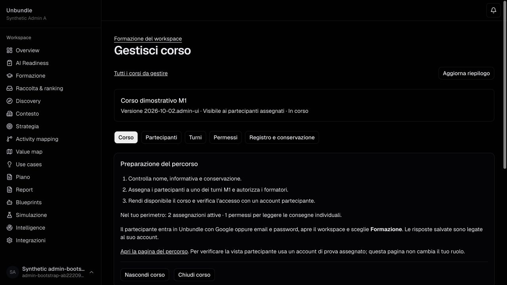
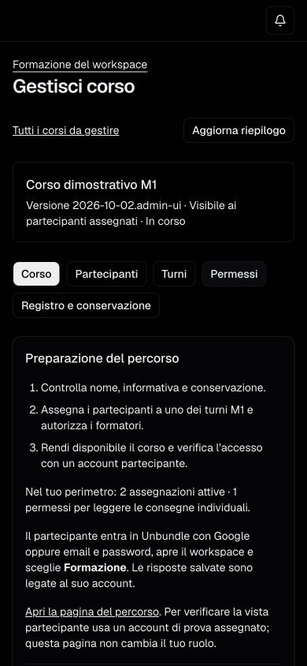
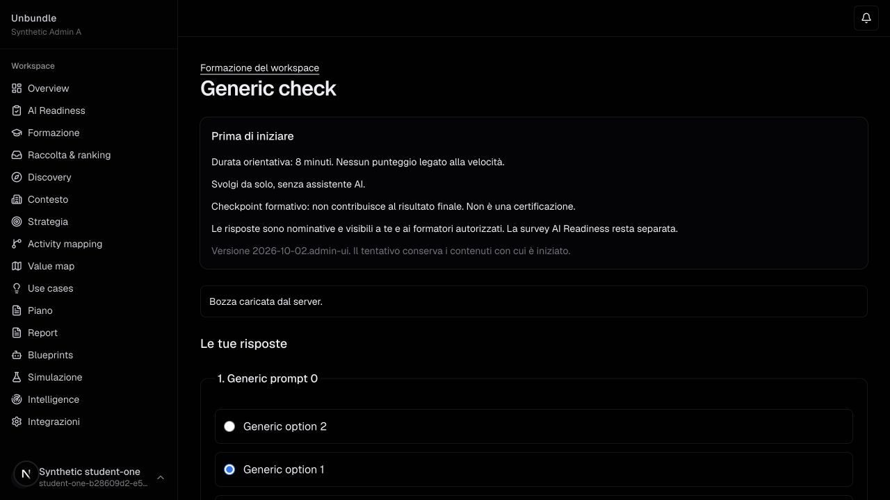
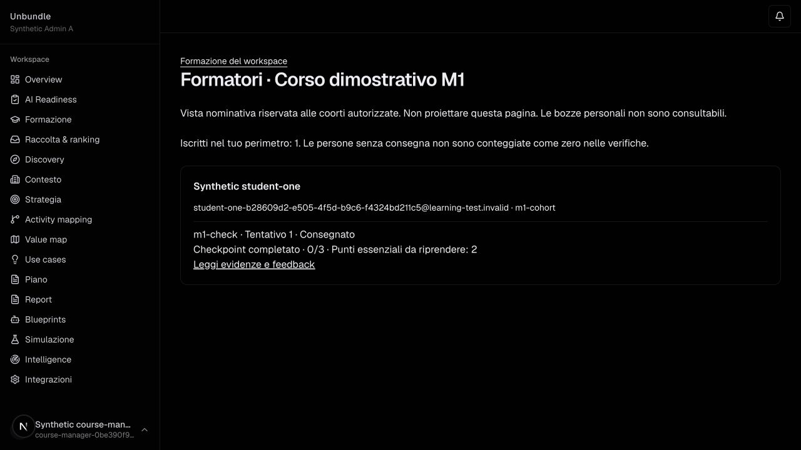

# Percorso amministratore → partecipante → formatore

Verifica del 2 ottobre 2026 nel solo ambiente locale isolato: PostgreSQL su loopback, Firebase Auth Emulator, sessione emessa e verificata dagli endpoint esistenti. Tutte le persone, gli indirizzi e i contenuti sono fittizi. Nessun invito o messaggio esterno è stato inviato. La prima sequenza è stata eseguita sul server di sviluppo; le verifiche finali di navigazione, tastiera e mobile sono state ripetute sulla build ottimizzata.

## Percorso provato

| Passaggio | Esito osservato |
| --- | --- |
| Amministratore di un workspace senza corsi | PASS: catalogo e importazione disponibili, senza assegnare accessi nominativi impliciti. |
| Caricamento JSON generico e verifica | PASS: riepilogo con versione, conteggi e date; nessuna domanda o soluzione nel riepilogo. |
| Importazione confermata | PASS: corso creato nascosto e presente nell’elenco; soltanto gestione dell’intero corso assegnata al creatore. |
| Assegnazione multipla | PASS: due persone assegnate al primo turno. |
| Cambio turno prima dell’inizio | PASS: seconda persona spostata alla seconda replica. |
| Apertura manuale e visibilità | PASS: primo turno aperto e corso reso disponibile dopo conferma. |
| Autorizzazione, revoca e nuova autorizzazione | PASS: formatore fittizio autorizzato alla lettura delle consegne del solo primo turno; lo storico della revoca rimane visibile. |
| Partecipante assegnato | PASS: vede il corso, il turno, l’informativa e il formatore; non vede i comandi amministrativi. |
| Avvio e salvataggio | PASS: risposta selezionata, conferma “Salvato” ricevuta. |
| Uscita e ripresa | PASS: comando reale “Esci” porta alla pagina di login; scheda chiusa; nuovo accesso dello stesso utente sintetico tramite helper dell’emulatore, nuova scheda, “Riprendi” ricarica dal server la stessa risposta e lo stesso ordine delle opzioni. |
| Consegna e correzione | PASS: checkpoint completato dopo riepilogo e invio esplicito, feedback ricevuto. Un solo tentativo consegnato e un solo evento di consegna nel database. |
| Vista formatori | PASS: il formatore vede la consegna della prima persona; la seconda replica è assente. |
| Impostazioni | PASS: conservazione impostata a 120 giorni; valore ritrovato nella build finale. |
| Cambio turno dopo l’avvio | PASS UI: controllo assente per la persona che ha lavorato e presente per l’altra; diniego server verificato anche dalla suite HTTP. |
| Registro e conservazione | PASS: operazioni amministrative visibili, nessuna risposta o voto nel registro; cancellazione non disponibile prima della scadenza. |

Le selezioni volutamente errate nella fixture producono feedback coerente; non sono risposte di partecipanti reali. Le prove complete del caso in due fasi e del recupero sono documentate nella precedente [journey M1](browser.md); la suite HTTP del nuovo codice ne verifica nuovamente il comportamento.

## Tastiera e mobile sulla build finale

- **PASS**: attivazione di “Chiudi corso” con Invio; focus sul pulsante di conferma; Tab → Annulla → Invio riporta il focus al comando iniziale. Nessuna chiusura applicata in questa prova.
- **PASS**: “Aggiorna riepilogo” con Invio porta il focus alla conferma, anziché lasciarlo sul corpo della pagina.
- **PASS**: schede del pannello azionabili da tastiera.
- **PASS**: vista desktop e mobile 390 × 844; i pulsanti vanno a capo e il contenuto resta nella pagina. Misura DOM: larghezza contenuto 390, viewport 390; nessun overflow orizzontale.
- **PASS**: nessun errore di console o overlay rilevato nella scheda della build finale.
- **BLOCKED**: prova con lettore di schermo reale, provider Google/email in ambiente distribuito e inviti reali. L’helper non dimostra il popup Google o il form password sul dominio di rilascio.

Durante il passaggio da sviluppo a build ottimizzata, una scheda rimasta aperta ha mostrato l’errore di connessione dopo l’arresto del server. L’automazione non poteva ricaricare l’URL interno di quella pagina d’errore; una nuova scheda sul normale indirizzo locale ha completato le verifiche. Non è stata modificata l’applicazione per aggirare un controllo del browser.

## URL effettivamente visitati

Questi URL appartengono al corso generico locale, non al pacchetto cliente e non alla produzione. Dopo l’arresto dei servizi non sono raggiungibili; non usarli nei deck o nei QR del training.

- [Catalogo amministrazione](http://127.0.0.1:53100/dashboard/0dccc3c8-81ee-4f6f-badb-db3770e96f0b/learning/admin)
- [Gestione corso](http://127.0.0.1:53100/dashboard/0dccc3c8-81ee-4f6f-badb-db3770e96f0b/learning/bce91e7c-6f1f-4821-bc7d-22975a652ff4/admin)
- [Percorso verificato come partecipante](http://127.0.0.1:53100/dashboard/0dccc3c8-81ee-4f6f-badb-db3770e96f0b/learning/bce91e7c-6f1f-4821-bc7d-22975a652ff4)
- [Checkpoint verificato come partecipante](http://127.0.0.1:53100/dashboard/0dccc3c8-81ee-4f6f-badb-db3770e96f0b/learning/bce91e7c-6f1f-4821-bc7d-22975a652ff4/activities/m1-check)
- [Vista formatori verificata con permesso di una sola replica](http://127.0.0.1:53100/dashboard/0dccc3c8-81ee-4f6f-badb-db3770e96f0b/learning/bce91e7c-6f1f-4821-bc7d-22975a652ff4/manage)

## Schermate e ricevuta database

Le immagini includono esclusivamente fixture generiche. Le date delle fixture non sostituiscono quelle del pacchetto didattico riservato.

La ricevuta `admin-browser-database-check.json` della raccolta di evidenze conferma iscrizioni, permessi, tentativo, revisione, ricevuta idempotente e singolo evento di consegna senza serializzare risposte personali.
